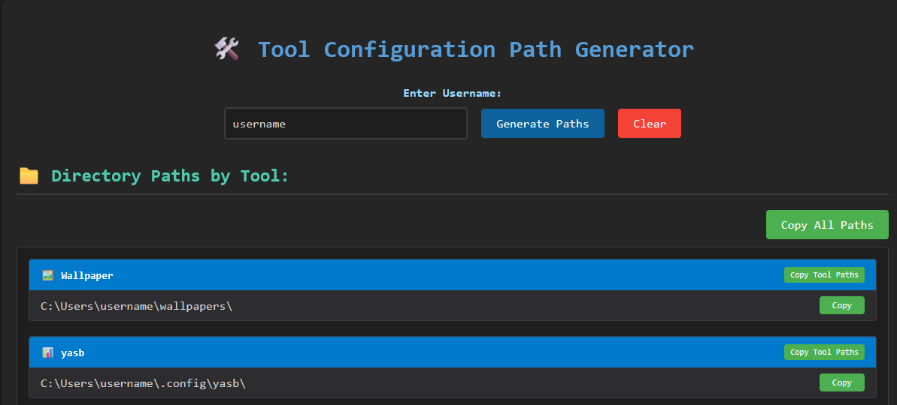

# Windows-11-sunflower-rice

the easiest is to clone the project with the command

```bash
git clone https://github.com/Wuju-sudo/Windows-11-sunflower-rice.git
```

or click on the green button with "code" written on it to download as zip and extract
Note task bar is usually on automatically hide in windows settings 
or you can also use tools like explorer patcher
it is obvious you must change "<username>" to your actual username
I added a tool called "Username_Exchanger.html" you write your actual user name and it provided a list of paths for that username


## 1. Core Tools & Features

| 🛠️ Tool | ⚙️ Config | 📁 Location | 📄 Description |
|---------|-----------|-------------|----------------|
| **[Wallpaper](https://github.com/Wuju-sudo/Windows-11-sunflower-rice/tree/63acce2c51b24df51fbe7fb36026c414697d2944/9.Wallpaper)** | - | `C:\Users\<username>\wallpapers\`<br>or any preferred location | Desktop wallpaper management |
| **[yasb](https://github.com/amnweb/yasb)** | [✓](https://github.com/Wuju-sudo/Windows-11-sunflower-rice/tree/63acce2c51b24df51fbe7fb36026c414697d2944/1.YASB) | `C:\Users\<username>\.config\yasb\config.yaml`<br>`C:\Users\<username>\.config\yasb\styles.css` | Yet Another Status Bar (top bar) |
| **[komorebi](https://github.com/LGUG2Z/komorebi)** | [✓](https://github.com/Wuju-sudo/Windows-11-sunflower-rice/tree/63acce2c51b24df51fbe7fb36026c414697d2944/2.Komorebi) | `C:\Users\<username>\komorebi.json`<br>`C:\Users\<username>\applications.json`<br>`C:\Users\<username>\komorebi.bar.json`<br>`C:\Users\<username>\.config\whkdrc` | Tiling window manager for Windows |
| **[Windows Terminal](https://github.com/microsoft/terminal)** | [✓](https://github.com/Wuju-sudo/Windows-11-sunflower-rice/tree/63acce2c51b24df51fbe7fb36026c414697d2944/3.Windows%20Terminal) | `C:\Users\<username>\AppData\Local\Packages\Microsoft.WindowsTerminal_8wekyb3d8bbwe\LocalState\settings.json`<br>`C:\Users\<username>\AppData\Local\Packages\Microsoft.WindowsTerminalPreview_8wekyb3d8bbwe\LocalState\settings.json` | Terminal emulator<br>⚠️ *Backup original configs - requires tiling WM for window control* |
| **[starship](https://github.com/starship/starship)** | [✓](https://github.com/Wuju-sudo/Windows-11-sunflower-rice/tree/63acce2c51b24df51fbe7fb36026c414697d2944/4.Starship) | `C:\Users\<username>\.config\starship.toml` | Cross-shell prompt |
| **[PowerShell](https://github.com/PowerShell/PowerShell)** | [✓](https://github.com/Wuju-sudo/Windows-11-sunflower-rice/tree/63acce2c51b24df51fbe7fb36026c414697d2944/5.Powershell) | `C:\Users\<username>\Documents\PowerShell\Microsoft.PowerShell_profile.ps1` | Windows shell configuration |
| **[Flow Launcher](https://github.com/Flow-Launcher/Flow.Launcher)** | [✓](https://github.com/Wuju-sudo/Windows-11-sunflower-rice/tree/63acce2c51b24df51fbe7fb36026c414697d2944/6.Flow%20Launcher) | `C:\Users\<username>\AppData\Roaming\FlowLauncher\Themes\theme.xaml` | Keystroke launcher |
| **[cava](https://github.com/karlstav/cava)** | [✓](https://github.com/Wuju-sudo/Windows-11-sunflower-rice/tree/63acce2c51b24df51fbe7fb36026c414697d2944/7.cava) | `C:\Users\<username>\.config\cava\config`<br>`C:\Users\<username>\.config\cava\shaders\` | Audio visualizer |
| **[fastfetch](https://github.com/fastfetch-cli/fastfetch)** | [✓](https://github.com/Wuju-sudo/Windows-11-sunflower-rice/tree/63acce2c51b24df51fbe7fb36026c414697d2944/8.fastfetch) | `C:\Users\<username>\.config\fastfetch\config.jsonc` | System information tool |

## 2. Additional Terminal Tools

These tools should be added to your system PATH for terminal access:

1. **[zclock](https://github.com/tr1ckydev/zclock)** - Terminal clock
2. **[pipes-rs](https://github.com/lhvy/pipes-rs)** - Animated pipes screensaver
3. **[btm](https://github.com/ClementTsang/bottom)** - Hardware resources monitor

to access system PATH type in windows search "Edit the system environment variables"

## 3. Komorebi Configuration

This is for whkdrc file

### Key Bindings Modifications:
```
# Terminal launch (comment out if not needed)
alt + t : if ($wshell.AppActivate('wt') -eq $False) { start wt }

# Float toggle (changed from alt + t to avoid conflict)
alt + f : komorebic toggle-float
```

## 4. WindHawk Setup

### Required Mods:
1. Windows 11 Taskbar Styler
2. Windows 11 Start Menu Styler
3. Windows 11 Notification Center Styler
4. Taskbar Clock Customization

from this [Folder](https://github.com/Wuju-sudo/Windows-11-sunflower-rice/tree/63acce2c51b24df51fbe7fb36026c414697d2944/10.WindHawk)
### Configuration Steps:
1. Install each mod
2. Go to **Advanced** settings for each
3. Apply the corresponding config file:
   - `Windows 11 Taskbar Styler.txt`
   - `Windows 11 Start Menu Styler.txt`
   - `Windows 11 Notification Center Styler.txt`
   - `Taskbar Clock Customization.txt`

### Special Note for Start Menu:
Add to **Custom process inclusion list**: `SearchHost.exe`

## 5. Windows Settings

Navigate to **Settings → Personalization** and enable:
- Transparency effects: **ON**
- Accent color: **Automatic**

## 6. Zen Browser Configuration

my configs are [here](https://github.com/Wuju-sudo/Windows-11-sunflower-rice/tree/63acce2c51b24df51fbe7fb36026c414697d2944/11.Zen%20Browser)
For Firefox-based browsers only:

1. **Enable custom styling:**
   - Navigate to `about:config`
   - Search for `toolkit.legacyUserProfileCustomizations.stylesheets`
   - Set to `true`

2. **Locate profile folder:**
   - Navigate to `about:support`
   - Find "Profile Folder" and click "Open Folder"

3. **Copy styling configs:**
   - `<Profile Folder>/chrome/userChrome.css`
   - `<Profile Folder>/chrome/userContent.css`

4. **Restart browser** to apply changes

## 7. Terminal Image Display

To display images in Windows Terminal, convert to SIXEL format using [ImageMagick](https://imagemagick.org/index.php):

```bash
magick image.png -resize 200x sixel:image.sixel
```
*Adjust the `200x` value as needed*
